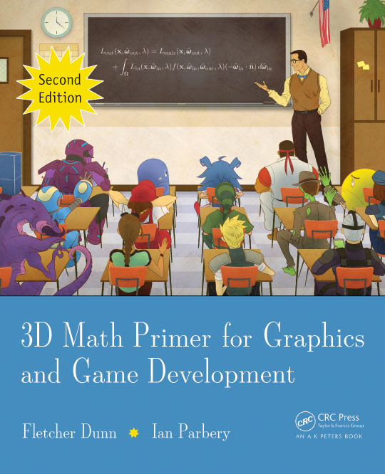
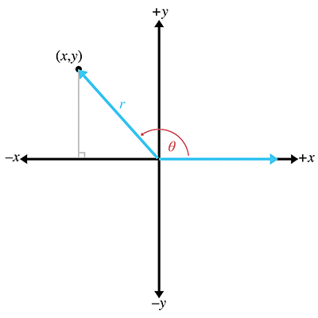

This page will display the notes that I took while reading the book [*3D Math Primer for Graphics and Game Development*](https://gamemath.com/) by 
Fletcher Dunn and Ian Parbery.
I am reading this book to learn the mathematical concepts behind 2D and 3D objects in games, namely their positions, orientations, trajectories, and more. With this, I hope to demonstrate 3D vector math knowledge to future employers.

# Table of Contents
- [Introduction](#introduction)
- [Chapter 1](#chapter-1-cartesian-coordinate-systems)
<!-- - [Chapter 2](#chapter-2-vectors) -->
<!-- - [Chapter 3](#chapter-3-multiple-coordinate-spaces) -->
<!-- - [Chapter 4](#chapter-4-introduction-to-matrices) -->
<!-- - [Chapter 5](#chapter-5-matrices-and-linear-transformations) -->
<!-- - [Chapter 6](#chapter-6-more-on-matrices) -->
<!-- - [Chapter 7](#chapter-7-polar-coordinate-systems) -->
<!-- - [Chapter 8](#chapter-8-rotation-in-three-dimensions) -->
<!-- - [Chapter 9](#chapter-9-geometric-primitives) -->
<!-- - [Chapter 10](#chapter-10-mathematical-topics-from-3d-graphics) -->
<!-- - [Chapter 11](#chapter-11-mechanics-1-linear-kinematics-and-calculus) -->
<!-- - [Chapter 12](#chapter-12-mechanics-2-linear-and-rotational-dynamics) -->
<!-- - [Chapter 13](#chapter-13-curves-in-3d) -->
<!-- - [Chapter 14](#chapter-14-afterword) -->

# [**Introduction**](https://gamemath.com/book/intro.html) 
This section gave me a very good overview of the book as a whole. I am very excited to be reading about many different areas of mathematics such as trigonometry, linear algebra, and calculus. I have experience with all of these topics from my undergraduate education, but I am excited to learn how it is put into practice!

# [**Chapter 1:** Cartesian Coordinate Systems](https://gamemath.com/book/cartesianspace.html)
## **1.1** - 1D Mathematics
- The *Cartesian coordinate system* is used to measure locations, distances, and angles mathematically in 2D and 3D spaces
- In programming, all variable types are discrete in the end, including everything from *short* and *int* to *float* and *double*. 
    - Choosing a variable type is less so a matter of rational versus natural numbers, but rather a matter of precision needed
- The first law of computer graphics: if it *looks* right, it *is* right

## **1.2** - 2D Cartesian Space
- Cartesian implies *rectangular*. Your basic xy-axis is Cartesian, for instance.
- A 2D Cartesian coordinate space is defined by two things: the origin of the (boundless) plane and the two axis' that run perpendicular through it
- Normal orientation of a 2D plane implies that North faces up and East faces right (as it should be), but 2D planes can be in any orientation.
- All 2D planes can be rotated or reoriented to become the normal orientation, thus suggesting all planes in the 2D space are equal.
This is not the case in 3D
- 2D Cartesian coordinates are (x, y) (naturally enough)

## **1.3** - 3D Cartesian Space
- The conventions for defining the position and negative directions for each x, y, and z axis in 3D is not standardized like it
is in 2D.
- 3D Cartesian coordinates are (x, y, z)
- You can orient a 3D space to have 2 of the axis line up with the direction you want, but the third axis will always point in the wrong direction. In other words, unlike 2D space, not all 3D spaces can be rotated in a way to line up with another.
- There are two types of 3D coordinate spaces: left-handed and right-handed.
    - If two coordinate spaces have the same "handiness", then they can be rotated to match each other
    - Positive and negative rotation about an axis differs between left- and right-handed coordinate spaces.
    Refer to [this diagram](https://gamemath.com/book/cartesianspace.html#left_vs_right_rotation) for a good visual explanation

## **1.4** - Odds and Ends
- Summation notation is for adding a bunch of terms together
    - There is also an equivalent procedure for multiplying terms together which, though unnamed, I will call product notation
- Be familiar with interval notation: [x,y], (x,y], [x,y), (x,y)
- (x,y) could either refer to a point in 2D space or an open (exclusive) interval
- [x,y] could either refer to a 2D vector or a closed (inclusive) interval
- Angle measures can be in *degrees*, which range from 0-360, or *radians*, which range from 0π-2π
    - `1 rad = (180/π) deg`
    - `1 deg = (π/180) rad`
- Trig functions for defining the x- and y- coordinates of a rotated point on the unit circle:
    - `cos(θ) = x`
    - `sin(θ) = y`
- More trig functions:
    - `sec(θ) = 1/cos(θ)`
    - `csc(θ) = 1/sin(θ)`
    - `tan(θ) = sin(θ)/cos(θ)`
    - `cot(θ) = 1/tan(θ) = cos(θ)/sin(θ)`
- More generalized trig functions on the unit circle considering the following figure:

    - `cos(θ) = x/r`, `sin(θ) = y/r`, `tan(θ) = y/x`
    - `sec(θ) = r/x`, `csc(θ) = r/y`, `cot(θ) = x/y`
- Trig identities:
    - `sin(-θ) = -sin(θ)`, `cos(-θ) = -cos(θ)`, `tan(-θ) = -tan(θ)`
    - `sin((π/2)-θ) = cos(θ)`, `cos((π/2)-θ) = sin(θ)`, `tan((π/2)-θ) = cot(θ)`
- Identities from applying the Pythagorean theorem to the unit circle:
    - `sin^2(θ) + cos^2(θ) = 1`
    - `1 + tan^2(θ) = sec^2(θ)`
    - `1 + cot^2(θ) = csc^2(θ)`
- Also refer to the *sum and difference identities*, *double angle identities*, and the *law of sines* and *law of cosines*

<!-- # [**Chapter 2:** Vectors](https://gamemath.com/book/vectors.html) -->
<!-- # [**Chapter 3:** Multiple Coordinate Spaces](https://gamemath.com/book/multiplespaces.html) -->
<!-- # [**Chapter 4:** Introduction to Matrices](https://gamemath.com/book/matrixintro.html) -->
<!-- # [**Chapter 5:** Matrices and Linear Transformations](https://gamemath.com/book/matrixtransforms.html) -->
<!-- # [**Chapter 6:** More on Matrices](https://gamemath.com/book/matrixmore.html) -->
<!-- # [**Chapter 7:** Polar Coordinate Systems](https://gamemath.com/book/polarspace.html) -->
<!-- # [**Chapter 8:** Rotation in Three Dimensions](https://gamemath.com/book/orient.html) -->
<!-- # [**Chapter 9:** Geometric Primitives](https://gamemath.com/book/geomprims.html) -->
<!-- # [**Chapter 10:** Mathematical Topics from 3D Graphics](https://gamemath.com/book/graphics.html) -->
<!-- # [**Chapter 11:** Mechanics 1: Linear Kinematics and Calculus](https://gamemath.com/book/kinematics_calculus.html) -->
<!-- # [**Chapter 12:** Mechanics 2: Linear and Rotational Dynamics](https://gamemath.com/book/dynamics.html) -->
<!-- # [**Chapter 13:** Curves in 3D](https://gamemath.com/book/curves.html) -->
<!-- # [**Chapter 14:** Afterword](https://gamemath.com/book/afterword.html) -->