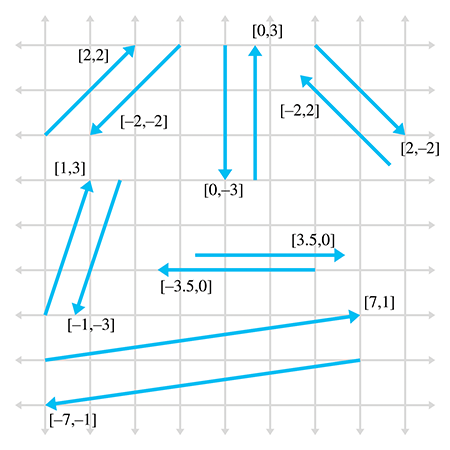

This page will display the notes that I took while reading the book [*3D Math Primer for Graphics and Game Development*](https://gamemath.com/) by 
Fletcher Dunn and Ian Parbery.
I am reading this book to learn the mathematical concepts behind 2D and 3D objects in games, namely their positions, orientations, trajectories, and more. With this, I hope to demonstrate 3D vector math knowledge to future employers.

# Table of Contents
- [Introduction](#introduction)
- [Chapter 1](#chapter-1-cartesian-coordinate-systems)
- [Chapter 2](#chapter-2-vectors)
<!-- - [Chapter 3](#chapter-3-multiple-coordinate-spaces) -->
<!-- - [Chapter 4](#chapter-4-introduction-to-matrices) -->
<!-- - [Chapter 5](#chapter-5-matrices-and-linear-transformations) -->
<!-- - [Chapter 6](#chapter-6-more-on-matrices) -->
<!-- - [Chapter 7](#chapter-7-polar-coordinate-systems) -->
<!-- - [Chapter 8](#chapter-8-rotation-in-three-dimensions) -->
<!-- - [Chapter 9](#chapter-9-geometric-primitives) -->
<!-- - [Chapter 10](#chapter-10-mathematical-topics-from-3d-graphics) -->
<!-- - [Chapter 11](#chapter-11-mechanics-1-linear-kinematics-and-calculus) -->
<!-- - [Chapter 12](#chapter-12-mechanics-2-linear-and-rotational-dynamics) -->
<!-- - [Chapter 13](#chapter-13-curves-in-3d) -->
<!-- - [Chapter 14](#chapter-14-afterword) -->

# [**Introduction**](https://gamemath.com/book/intro.html) 
This section gave me a very good overview of the book as a whole. I am very excited to be reading about many different areas of mathematics such as trigonometry, linear algebra, and calculus. I have experience with all of these topics from my undergraduate education, but I am excited to learn how it is put into practice!

# [**Chapter 1:** Cartesian Coordinate Systems](https://gamemath.com/book/cartesianspace.html)
## **1.1** - 1D Mathematics
- The *Cartesian coordinate system* is used to measure locations, distances, and angles mathematically in 2D and 3D spaces
- In programming, all variable types are discrete in the end, including everything from *short* and *int* to *float* and *double*. 
    - Choosing a variable type is less so a matter of rational versus natural numbers, but rather a matter of precision needed
- The first law of computer graphics: if it *looks* right, it *is* right

## **1.2** - 2D Cartesian Space
- Cartesian implies *rectangular*. Your basic xy-axis is Cartesian, for instance.
- A 2D Cartesian coordinate space is defined by two things: the origin of the (boundless) plane and the two axis' that run perpendicular through it
- Normal orientation of a 2D plane implies that North faces up and East faces right (as it should be), but 2D planes can be in any orientation.
- All 2D planes can be rotated or reoriented to become the normal orientation, thus suggesting all planes in the 2D space are equal.
This is not the case in 3D
- 2D Cartesian coordinates are (x, y) (naturally enough)

## **1.3** - 3D Cartesian Space
- The conventions for defining the position and negative directions for each x, y, and z axis in 3D is not standardized like it
is in 2D.
- 3D Cartesian coordinates are (x, y, z)
- You can orient a 3D space to have 2 of the axis line up with the direction you want, but the third axis will always point in the wrong direction. In other words, unlike 2D space, not all 3D spaces can be rotated in a way to line up with another.
- There are two types of 3D coordinate spaces: left-handed and right-handed.
    - If two coordinate spaces have the same "handiness", then they can be rotated to match each other
    - Positive and negative rotation about an axis differs between left- and right-handed coordinate spaces.
    Refer to [this diagram](https://gamemath.com/book/cartesianspace.html#left_vs_right_rotation) for a good visual explanation

## **1.4** - Odds and Ends
- Summation notation is for adding a bunch of terms together
    - There is also an equivalent procedure for multiplying terms together which, though unnamed, I will call product notation
- Be familiar with interval notation: [x,y], (x,y], [x,y), (x,y)
- (x,y) could either refer to a point in 2D space or an open (exclusive) interval
- [x,y] could either refer to a 2D vector or a closed (inclusive) interval
- Angle measures can be in *degrees*, which range from 0-360, or *radians*, which range from 0π-2π
    - `1 rad = (180/π) deg`
    - `1 deg = (π/180) rad`
- Trig functions for defining the x- and y- coordinates of a rotated point on the unit circle:
    - `cos(θ) = x`
    - `sin(θ) = y`
- More trig functions:
    - `sec(θ) = 1/cos(θ)`
    - `csc(θ) = 1/sin(θ)`
    - `tan(θ) = sin(θ)/cos(θ)`
    - `cot(θ) = 1/tan(θ) = cos(θ)/sin(θ)`
- More generalized trig functions on the unit circle considering the following figure:

    - `cos(θ) = x/r`, `sin(θ) = y/r`, `tan(θ) = y/x`
    - `sec(θ) = r/x`, `csc(θ) = r/y`, `cot(θ) = x/y`
- Trig identities:
    - `sin(-θ) = -sin(θ)`, `cos(-θ) = -cos(θ)`, `tan(-θ) = -tan(θ)`
    - `sin((π/2)-θ) = cos(θ)`, `cos((π/2)-θ) = sin(θ)`, `tan((π/2)-θ) = cot(θ)`
- Identities from applying the Pythagorean theorem to the unit circle:
    - `sin^2(θ) + cos^2(θ) = 1`
    - `1 + tan^2(θ) = sec^2(θ)`
    - `1 + cot^2(θ) = csc^2(θ)`
- Also refer to the *sum and difference identities*, *double angle identities*, and the *law of sines* and *law of cosines*

# [**Chapter 2:** Vectors](https://gamemath.com/book/vectors.html)
## **2.1** - Mathematical Definition of Vector
- Mathematically, vectors are a list of numbers
- Scalars are ordinary numbers
    - Ex: "velocity" and "displacement" are vector quantities while "speed" and "distance" are scalar quantities
- A vector's dimension is how many numbers it contains (the length)
    - A 1D vector has a single value (a scalar can be considered 1D), a 2D has two values, etc.
- Vector syntax: [1,2,3] (this is a *row vector*) (*column vectors* are written vertically)
- When refering to individual values within a vector, use subscript notation
    - Ex: `**a** = [3,4,5,6]`; 
    - `a_1 = a_x = 3`;
    - `a_2 = a_y = 4`;
    - `a_3 = a_z = 5`;
    - `a_4 = a_w = 6`;
- Common syntax for scalar, vector, and matrix variables:
    - Scalar quantities use lowercase in italics: *a*, *b*, *x*, *y*, *θ*
    - Vector quantities use lowercase in boldface: **a**, **b**, **u**, **v**
    - Matrix quantities use uppercase in boldface: **A**, **B**, **M**, **R**

## **2.2** - Geometric Definition of Vector
- Vectors are directed line segments with a *magnitude* and *direction*
    - *Magnitude*: length of the vector (nonnegative)
    - *Direction*: which way the vector is pointing in space
- The *head* of a vector refers to the end with the arrowhead on it and the *tail* refers to the opposite end
- Vectors do not have positions, only magnitudes and directions. Consider the following examples:
    - *Displacement*: "Take three steps forward" does not require a position
    - *Velocity*: "I am traveling northeast at 50 mph". It has a magnitude (50 mph) and direction (northeast), but no position
- Comparison of scalar values with their similar, but different, vector counterparts:
    - *Speed* (scalar) is the magnitude of the vector *velocity*
    - *Distance* (scalar) is the magnitude of the vector *displacement*
- Vectors are relative, not absolute, due to the lack of position

## **2.3** - Specifying Vectors with Cartesian Coordinates
- You can assign values to vectors using Cartesian Coordinates, but they do not represent a position in space, but
rather a displacement from the tail of the vector to the head of the vector.
    - Two vectors with the same value (ex: `(1.5, 1)`), can be represented at different locations in a plane because vectors have no position, but can share the same displacement.
    - Examples below

- Polar coordinates can also be used to specify vectors (refer to Chapter 7 for details)
- The 3D vector [1,-3,4] represents a single displacement
    - 1 unit to the right, 3 units down, and 4 units forward
    - The order in which the three sub-displacements take place does not matter; the total displacement will be the same
- The zero vector has zeroes in all positions. Ex: 3D zero vector is [0,0,0]
    - It is the only vector in its dimension with zero magnitude and no direction
    - Describes "no displacement"

## **2.4** - Vectors versus Points
- *Points* specify a position while *vectors* specify a displacement
- Because vectors describe displacements, they can inherently describe relative positions
- Any point can be represented as a vector from the origin: (x,y) => [x,y]

## **2.5** - Negating a Vector
- Every vector **v** has an additive inverse **-v** such that `**v** + (**-v**) = 0`
    - Below are examples of vectors and their inverses

- To negate a vector of any dimension, simply distribute a negative sign to each element within the vector
    - Ex: `-[a_1, a_2, a_3] = [-a_1, -a_2, -a_3]`
    - Interpretation: negating a vector results in a vector of the same magnitude but in the opposite direction

## **2.6** - Vector Multiplication by a Scalar
- You can multiply (but not add) a scalar and a vector. Simply distribute the scalar into each value of the vector.
    - Ex: `k[a_1, a_2, a_3] = [ka_1, ka_2, ka_3]`
    - The result is a new vector parallel to the original, but possibly of different magnitude and opposite direction
    - Interpretation: multiplying a scalar into a vector scales the length of that vector (refer to figure below)
- You can also divide a vector by a scalar since it is the same as multiplying by the reciprocal
- Below is an example of scalar multiplication

- A scalar cannot be divided by a vector, nor can a vector be divided by another vector

## **2.7** - Vector Addition and Subtraction
- Vectors must be of the same dimension to be added or subtracted. The process is simple:
    - Ex: `[a_1, a_2, a_3] + [b_1, b_2, b_3] = [a_1 + b_1, a_2 + b_2, a_3 + b_3]`
    - Ex: `[a_1, a_2, a_3] - [b_1, b_2, b_3] = [a_1 - b_1, a_2 - b_2, a_3 - b_3]`
- You can use the *triangle rule* to add multiple vectors by positioning the tail of one vector at the head of the previous and connecting the tail of the first vector with the head of the last.
    - Consider the visual below

- When adding multiple vectors together, think of it like different forces being applied to an object (ex: wind is blowing you one way,
your car is bringing you another way, while your seat is moving backward). 
    - Below is a good visual for considering the result of applying many different forces to an object

- Finding the displacement between two points *a* and *b* is as simple as considering the vector representation of the points
and subtracting them: **b** - **a**

## **2.8** - Vector Magnitude (Length)
- *Magnitude* = *length* or *norm* of vector
- Since vectors are represented by a cartesian coordinate (ex: (3,4)), which does not represent either magnitude or displacement, 
the maginutude must be computed
- A magnitude is represented mathematically with double pipes: ||**v**|| (magnitude of **v**) (sometimes represented with one bar)
- Computing the magnitude
    - Take the square root of the sum of the square of each component in the vector
    - (Pretty much the Pythagorean theorem)
    - Below is the formula for the magnitude of an arbitrarily-sized vector

    - Below is the formula for 2D and 3D vectors

## **2.9** - Unit Vectors
- A unit vector, or *normalized* vector, has a magnitude of 1
- Useful when we dont care about magnitude, only direction (I want to know which way I am facing, but thats it)
- **NOTE**: a *normal* vector is one that is perpendicular to a surface (usually still with unit length), so don't get confused
- *Normalizing* a vector means to compute a new vector whos magnitude is 1 (unit length) but points in the same direction as the original
    - Common case is to use the "hat" symbol to mark a variable as a normalized vector (ex: "v hat")
    - To normalize a vector, divide the vector by its magnitude (shown below)

- The zero vector cannot be normalized

## **2.10** - Distance Formula
- Refer to the image below for the distance formula for 2D and 3D vectors

## **2.11** - Vector Dot Product
- The *dot product* is also known as the *inner product*
- The dot product *must* be represented with the dot symbol between the vectors
- The dot product of two vectors is the sum of the products of corresponding components
    - It results in a *scalar* (refer to formula below)

- The dot product can be used to determine the angle between two vectors using the following formula:

- The dot product can also measure the length of the projection of **b** onto **a**, multiplied by the length of **a**

## **2.12** - Vector Cross Product
- A *cross product* can only be applied in 3D and yields a 3D vector
- The cross product will always use the cross symbol (x)
- The cross product yields a vector that is perpendicular to the original two vectors (shown below)

- The length of **a** x **b** is equal to the product of the magnitudes or **a** and **b** and the sine of the angle between them:
    - `||a x b|| = ||a|| ||b|| sin(θ)`

## **2.13** - Linear Algebra Identities
- No need to memorize these

<!-- # [**Chapter 3:** Multiple Coordinate Spaces](https://gamemath.com/book/multiplespaces.html) -->
<!-- # [**Chapter 4:** Introduction to Matrices](https://gamemath.com/book/matrixintro.html) -->
<!-- # [**Chapter 5:** Matrices and Linear Transformations](https://gamemath.com/book/matrixtransforms.html) -->
<!-- # [**Chapter 6:** More on Matrices](https://gamemath.com/book/matrixmore.html) -->
<!-- # [**Chapter 7:** Polar Coordinate Systems](https://gamemath.com/book/polarspace.html) -->
<!-- # [**Chapter 8:** Rotation in Three Dimensions](https://gamemath.com/book/orient.html) -->
<!-- # [**Chapter 9:** Geometric Primitives](https://gamemath.com/book/geomprims.html) -->
<!-- # [**Chapter 10:** Mathematical Topics from 3D Graphics](https://gamemath.com/book/graphics.html) -->
<!-- # [**Chapter 11:** Mechanics 1: Linear Kinematics and Calculus](https://gamemath.com/book/kinematics_calculus.html) -->
<!-- # [**Chapter 12:** Mechanics 2: Linear and Rotational Dynamics](https://gamemath.com/book/dynamics.html) -->
<!-- # [**Chapter 13:** Curves in 3D](https://gamemath.com/book/curves.html) -->
<!-- # [**Chapter 14:** Afterword](https://gamemath.com/book/afterword.html) -->